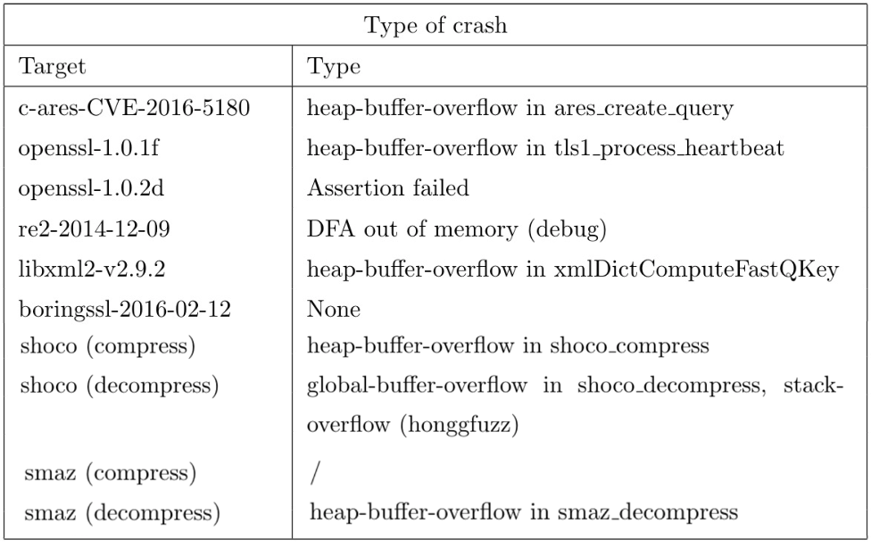

# Fuzzing Project

In this project, a variety of fuzzing tools (LibFuzzer, Hongfuzz, and AFL), were employed to conduct comprehensive testing on:
- [Google fuzzer suites](https://github.com/google/fuzzer-test-suite)
- [Shoco](https://github.com/Ed-von-Schleck/shoco) an open source C library to compress and decompress short strings
- [Smaz](https://github.com/antirez/smaz) another open source C compression library suitable for compressing very short strings
All of them are available on GitHub.

In the specific contexts of Shoco and Smaz, we also developed some modules in order to correctly apply fuzzers. 

The complete documentation is available [here1](https://github.com/federicominniti/FuzzingProject/blob/main/documentation.pdf); there is also a presentation of the project [here2](https://github.com/federicominniti/FuzzingProject/blob/main/presentation.pdf)

(Repository for ICT Risk assessment's project)

## Main goals are:
- to study and explore fuzzers
- to perform fuzz testing

## Preview

   

